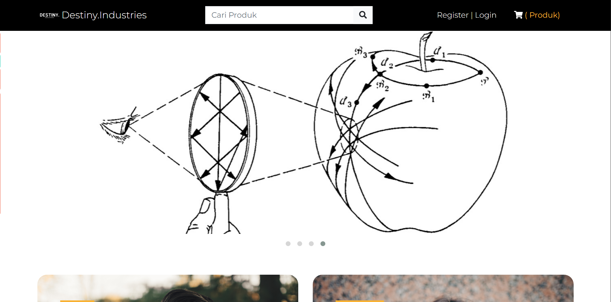
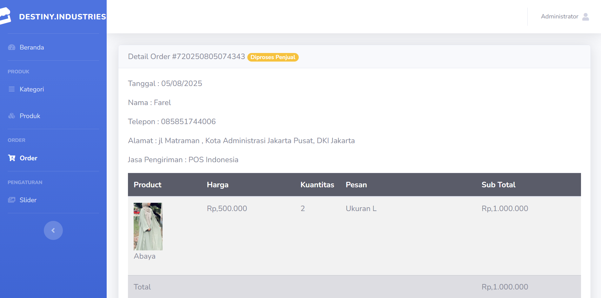

Setelah melakukan penelitian pada sistem informasi penjualan baju di Destiny.Industries, dihasilkan sebuah aplikasi sebagai bentuk perbaikan dari sistem informasi yang sebelumnya dilakukan secara manual menjadi sistem berbasis komputer.

Destiny.Industries adalah sebuah situs web _e-commerce_ yang menyediakan berbagai produk pakaian, seperti baju, celana, jaket, dan lain-lain.

Situs web ini dibangun dengan tujuan untuk memberikan pengalaman berbelanja _online_ yang mudah dan menyenangkan bagi para pelanggan.

Situs web ini dibangun menggunakan:

- [CodeIgniter 3](https://codeigniter.com/)
- [Bootstrap 4](https://getbootstrap.com/)
- [MySQL](https://www.mysql.com/)
- [PHP](https://www.php.net/)

## Perencanaan Manajemen Proyek

Proyek situs web ini dikembangkan untuk memenuhi kebutuhan masyarakat dalam berbelanja _online_, terutama untuk produk pakaian. Dengan adanya situs web ini, pelanggan dapat dengan mudah mencari dan membeli produk yang mereka inginkan tanpa harus pergi ke toko fisik.

Proyek diawali dengan pembuatan _Project Charter_ yang memuat tujuan, _project goal_, _deliverables_, _scope definition_, _project milestone_, _assumptions_, _constraints & dependencies_, _related documents_, _project organizational structure_, dan _project authorization_.

Langkah awalnya adalah pembuatan _Earned Value Analysis Report_ yang berisi:

_Planned Value_ (PV) atau _Budgeted Cost of Work Scheduled_ (BCWS)

- _Work Breakdown Structure_ (WBS)
- _Cumulative Planned Value_ (PV)

_Actual Cost_ dan _Earned Value_ (EV)

- _Cumulative Actual Cost_ (AC)
- _Cumulative Earned Value_ (EV)

_Project Performance Metrics_

- _Cost Variance_ (CV = EV - AC)
- _Schedule Variance_ (SV = EV - PV)
- _Cost Performance Index_ (CPI = EV / AC)
- _Schedule Performance Index_ (SPI = EV / PV)
- _Estimated Cost at Completion_ (EAC)

Tahap terakhir dari perencanaan ini adalah pembuatan _Project Management Plan_.

## Pengembangan

### Home

Berikut adalah tampilan halaman `Home` dari situs web _e-commerce_ Destiny.Industries yang menampilkan berbagai produk pakaian yang tersedia. Halaman ini dirancang dengan antarmuka yang menarik dan mudah dinavigasi sehingga pelanggan dapat menemukan produk yang mereka cari dengan cepat dan mudah.

### Admin

Halaman `Admin` digunakan untuk mengelola produk, kategori, dan pesanan yang masuk. Admin dapat menambahkan, mengubah, atau menghapus data produk, serta memantau pesanan yang sedang diproses. Halaman ini dirancang dengan antarmuka yang sederhana dan intuitif untuk memudahkan tugas admin dalam mengelola toko _online_.

Situs web ini bersifat _open source_ (sumber terbuka), sehingga siapa pun dapat mengakses kode sumbernya. Dengan demikian, diharapkan adanya kontribusi dari pengembang lain untuk membantu meningkatkan fitur dan fungsionalitas situs web, serta memberikan pengalaman berbelanja _online_ yang lebih baik bagi para pelanggan.



Berikan bintang jika kamu menyukai proyek ini ⭐
