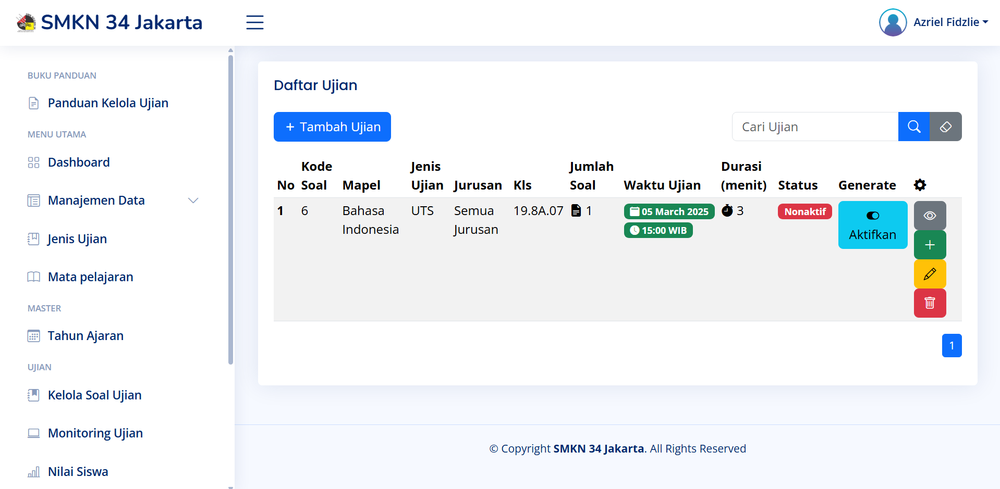
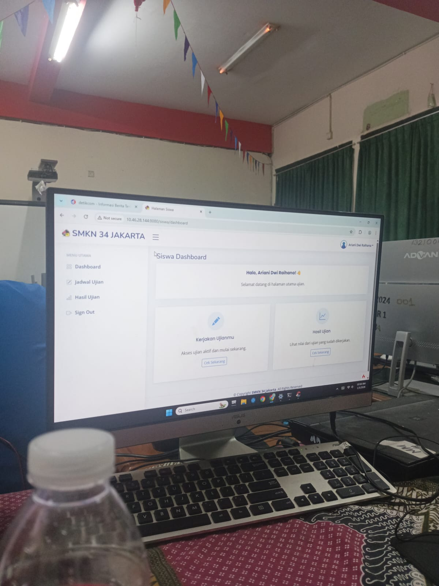
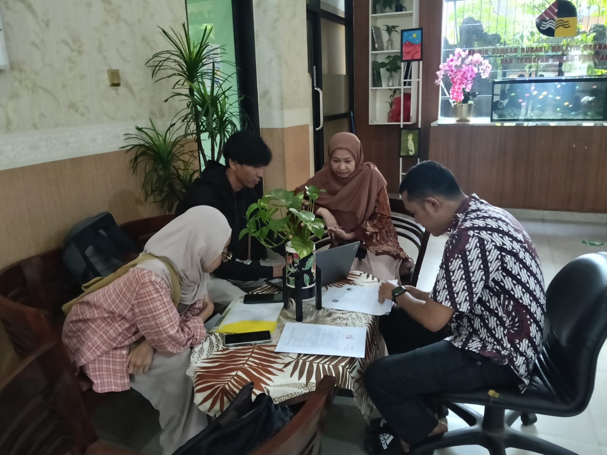

SMKN 34 Jakarta, located on Jl. Kramat Raya No. 93, Central Jakarta, is an A-accredited vocational high school (SMK) in engineering. Established in 1972, this school has produced many experts and has a strong track record of placing its graduates in leading manufacturing and engineering industries.

## Project Summary

This project is the development of a web-based online examination application (Computer-Based Test) for SMK Negeri 34 Jakarta. The goal is to replace the conventional platform to present an evaluation system that is more secure, integrated, and free from academic cheating.

## Problem Statement

Previously, we visited the school to analyze the examination activities, which were still using Google Docs at that time. As we know, using Google Docs for exams is quite vulnerable to cheating. Therefore, we had further discussions with the school and proposed the creation of a web-based application (CBT). The goal was to replace the conventional platform with a more secure, integrated evaluation system that prevents cheating.

## Development

In this project, our team consisted of three people:

- Azriel Fidzlie (Developer and Writer)
- Fatya Restu Pertiwi (Writer and UI/UX)
- Muhammad Daffa Rakan (Writer and Diagram Creator)

We started this project very enthusiastically because, besides being a graduation requirement for the undergraduate (S1) program, we also had the opportunity to contribute directly to our partner in developing a website.

We were given only 3 months to create a ready-to-use application that the school could immediately utilize. Therefore, we decided to use CodeIgniter 4 (CI4). In our opinion, CI4 is the right choice for the school scale and greatly simplifies the code development process. As a result, the web-based SMKN 34 Jakarta Online Examination application was successfully completed on time.

Of course, this phase was crucial. Feedback and input from stakeholders were an integral part of the development process. We constantly strived every day to accommodate features that were not yet in the application.

{style="width:50%;"}

Revision after revision, adding features, and fixing bugs were continuously carried out until this system became a complete application ready for use.

## Application Handover

{style="width:80%;"}

This certificate of appreciation is proof that we have successfully completed and handed over the project we developed. Below is some documentation of the SMKN 34 Jakarta Online Examination project handover.

[elearningsmkn34jkt.sch.id](https://elearningsmkn34jkt.sch.id/) `(Active)`




